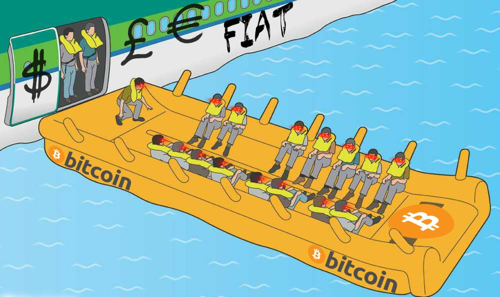

## Hi, I'm <i>DankSwoops</i>, a human rights dev from USA.

&nbsp;

**My life is a passion project:**

- 🪂 Parachutist: 5,000 skydives - creator of [MVP](https://raw.githubusercontent.com/dankswoops/dankswoops/main/Mixed%20Vertical%20Piloting.pdf)
- 👨🏽‍💻 Dev: I can build anything solo, but I enjoy good company while in the IDE
- ⚡️ Building Zaphub: a Nostr social client with uncensorable speech and unstoppable payments
- 🫟 Building NostrKeyring: a cross-browser NIP-07 signing extension
- 🧠 Focus: freedom technology, privacy by design, and zero-knowledge architecture
- 🌐 Open-source contributor: if IP isn’t a problem, I push to public

#

 

  
  

#

 

<table align="center">
  <thead align="center">
    <tr border: none;>
      <td><b>📦 Projects</b></td>
      <td><b>🌟 Stars</b></td>
      <td><b>🍴 Forks</b></td>
      <td><b>🐛 Issues</b></td>
      <td><b>🔁 Pull requests</b></td>
      <td><b>📝 Description</b></td>
    </tr>
  </thead>
  <tbody>
    <tr>
      <td><a href="https://github.com/dankswoops/NostrKeyring"><b>NostrKeyring</b></a></td>
      <td></td>
      <td></td>
      <td></td>
      <td></td>
      <td>Nip-07 Key Signer</td>
    </tr>
  </tbody>
</table>

 

  

